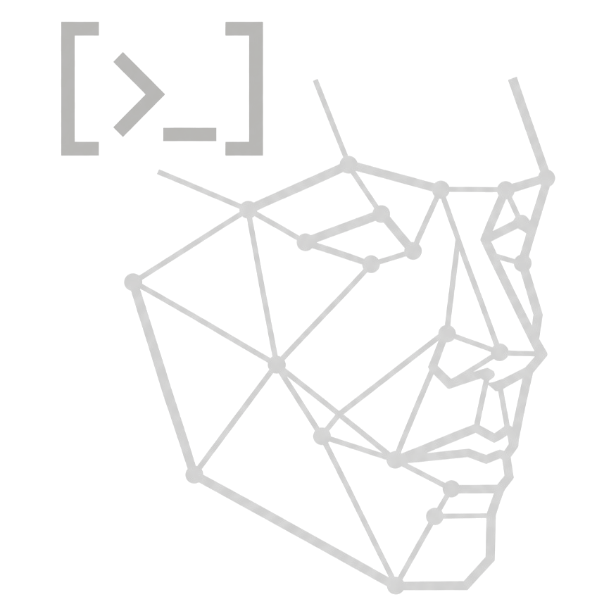

<p align="center">
  
</p>

<h1 align="center">Face Tracker Pro</h1>

<p align="center">
  <em>Real-time face tracking & analysis · 478 landmarks · tactical dashboard</em>
</p>

<p align="center">
  <em>Built by <a href="https://github.com/frnchy">frnchy</a></em>
</p>

---

It uses **MediaPipe** (478 facial landmarks + iris + 52-channel blendshapes) to compute a large set of facial features live from your webcam, and displays everything in an animated dashboard built with **CustomTkinter**.

It automatically uses whichever MediaPipe Python API is available on your system:

| Backend | Pip package | Python | Model file |
|---|---|---|---|
| **Tasks API** — `FaceLandmarker` (default, recommended) | `mediapipe` 0.10.30+ / community 3.13 builds | 3.10 – 3.13 | `face_landmarker.task` (auto-downloaded once, ~5 MB, cached at `~/.facetrack/`) |
| **Solutions API** — `FaceMesh` (legacy fallback) | `mediapipe` 0.10.0 – 0.10.14 | 3.10 – 3.12 | embedded in package |

You don't have to choose — the app auto-detects which one your `mediapipe` install supports.

## Features

### Detection / overlays (toggle any of them live)
- 468-point face mesh tesselation
- Face contours (eyes, lips, eyebrows, ovals)
- Iris tracking (left & right pupil centers)
- Bounding box + corner-marker HUD
- All raw landmarks
- 3D head-pose axes
- On-screen HUD with FPS / face count / blinks / distance
- Multi-face tracking (up to 2 simultaneously)

### Live analytics (animated widgets in the side panel)
- **FPS** counter
- **Faces detected** counter
- **Blink counter** (EAR-based) + **blinks per minute**
- **Smile** intensity (0–100%)
- **Mouth open** ratio
- **Eyebrow raise** (signed: raised vs furrowed)
- **Face symmetry** score
- **Distance from camera** (in cm, from interocular pixel width)
- **Head pose** — pitch / yaw / roll dials
- **Gaze direction** — radial widget + label (Up / Down / Left / Right / Center)
- **Face shape** classification: Oval, Round, Square, Heart, Diamond, Oblong, Triangle (with live probability bars)
- **Emotion** heuristic: Neutral, Happy, Surprised, Sad, Angry, Focused
- **EAR sparkline** — rolling eye-openness chart
- Live status pills (blinking now / smiling / mouth open / face detected)

### Filters
- None / Cartoon / Sketch / Edge / Sepia / Cool / Warm / Thermal

### Utility
- Snapshot capture (PNG → `~/FaceTrackerSnapshots/`)
- Video recording (MP4 → `~/FaceTrackerSnapshots/`)
- Mirror toggle
- Pause / resume
- Camera switcher (prev / next)
- Calibrate baselines (recenters smile / eyebrow detection on neutral expression)
- Reset blink counter
- Hotkeys: `Q` quit · `S` snapshot · `R` record · `Space` pause

### UI / animation polish
- Dark theme with cyan / purple accents
- Animated splash / loading screen with rotating spinner + step progress, runs dependency check, camera probe & MediaPipe warm-up in a background thread (with a Retry button on failure)
- Smooth eased value-tweening on every numeric bar / counter
- Animated radial gaze indicator
- Animated dial gauges for head pose
- Animated probability bars for face-shape classifier
- Rolling sparkline chart for eye openness
- Hover-glow buttons with active-state highlighting
- Status pills with colored state indicators

### Robustness / boot
- **Dependency checker** (`facetrack/bootstrap.py`) runs on every launch, also usable as a CLI: `python -m facetrack.bootstrap --diagnose`
- Preflight: refuses to start if `tkinter` / `customtkinter` are missing (with a clear pip command)
- Step-by-step boot: dependency check → camera probe → MediaPipe model load → analyzer init — each step reports its own progress and any failure points the user at a fix
- Build pipeline (`build.bat`) has 7 verification stages so you never end up with a broken `.exe`

---

## Quick start

### 1. Install Python 3.10 or newer
MediaPipe works on Python 3.10–3.13 on Windows. If `pip install mediapipe` fails because no wheel is published for your Python version yet, install Python 3.12 alongside it and use that to run this project (run `py -3.12 -m pip install -r requirements.txt`, then `py -3.12 main.py`).

### 2. Install dependencies
```powershell
cd d:\Projects\Face-Tracking
python -m pip install -r requirements.txt
```

### 3. Run the app
```powershell
python main.py
```

That's it — your webcam light should come on and the dashboard should populate within a second or two.

---

## How to turn it into a .exe

You have two options. **Option A is the one-click route** — just double-click `build.bat`.

### Option A — one-click build (recommended)

In the project root, double-click **`build.bat`**.
It runs a **multi-stage verification pipeline** so you find out about problems *before* spending five minutes on PyInstaller:

| Stage | What it does | Why |
|------:|---|---|
| 0 | Locate Python (`%PY%` override supported) | catches "wrong interpreter" problems |
| 1 | Run `python -m facetrack.bootstrap --diagnose` | reports every dep + version |
| 1b | If anything is missing, install **only** what's missing (not the whole `requirements.txt` again) | saves time, doesn't bounce versions |
| 2 | Make sure PyInstaller is present | self-installs if not |
| 3 | Actually instantiate `mediapipe.FaceMesh` once | catches missing `.tflite` model files |
| 4 | `import` every module in the app | catches syntax / import errors in your code |
| 5 | Wipe `build/`, `dist/`, the stale `.spec` | clean slate |
| 6 | Run PyInstaller with all the right flags | the actual build |
| 7 | Verify `exe/FaceTrackerPro.exe` exists and report its size | sanity check |
| 8 | If **Inno Setup** is installed, compile `installer.iss` into a real Windows installer | optional - skipped if not found |

> **Multiple Pythons installed?** Open `build.bat` and set `PY` at the top to point at the exact Python you want, e.g. `set PY=py -3.12` or `set PY="C:\Python311\python.exe"`.

### Building a Windows installer (with a path picker)

`build.bat` will *also* produce a proper Windows installer (`FaceTrackerPro_Setup_1.0.0.exe`) if **Inno Setup** is installed on your machine:

1. Download Inno Setup (free) from <https://jrsoftware.org/isinfo.php>
2. Install it with the defaults — `iscc.exe` ends up at `C:\Program Files (x86)\Inno Setup 6\ISCC.exe`
3. Re-run `.\build.bat`. Stage 8 will detect it automatically and compile `installer.iss`

The resulting installer:

- Has your brand icon
- Asks the user where to install (default `Program Files\FaceTrackerPro`)
- Optional desktop shortcut checkbox
- Start Menu folder
- Real uninstaller registered in Add/Remove Programs
- LZMA2 ultra compression so it's significantly smaller than the raw exe

You don't need Inno Setup to use the app — the standalone `exe\FaceTrackerPro.exe` works on its own. The installer is just nicer to ship.

When it finishes, your standalone executable lives at:

```
d:\Projects\Face-Tracking\dist\FaceTrackerPro.exe
```

Double-click that file to run the app — **no Python needed on the target machine**. You can copy that one exe to any Windows machine and it'll just work.

> First launch of the exe takes ~5–10 seconds (PyInstaller unpacks the bundle to a temp folder). Subsequent launches are faster.

### Option B — run PyInstaller manually

If you want to tweak the build, run this from the project root:

```powershell
python -m pip install --upgrade pyinstaller

python -m PyInstaller --noconfirm --onefile --windowed `
    --name FaceTrackerPro `
    --collect-all mediapipe `
    --collect-submodules mediapipe `
    --collect-data mediapipe `
    --collect-binaries mediapipe `
    --collect-all customtkinter `
    --collect-data cv2 `
    --hidden-import mediapipe `
    --hidden-import mediapipe.python `
    --hidden-import mediapipe.python.solutions `
    --hidden-import mediapipe.python.solutions.face_mesh `
    --hidden-import mediapipe.python.solutions.drawing_utils `
    --hidden-import mediapipe.python.solutions.drawing_styles `
    --hidden-import mediapipe.python.solutions.face_mesh_connections `
    --hidden-import PIL._tkinter_finder `
    main.py
```

> **Crucial:** use the same Python for `pip install` and `python -m PyInstaller`. If `python` resolves to a different interpreter than the one where mediapipe is installed, PyInstaller can't see it and the exe will crash with `ModuleNotFoundError: No module named 'mediapipe'`. Verify with `python -c "import mediapipe; print(mediapipe.__version__)"` before building.

Why each flag matters:
| Flag | Reason |
|------|--------|
| `--onefile` | Bundle everything into one `.exe` |
| `--windowed` | Don't open a console window when running |
| `--collect-all mediapipe` | MediaPipe ships binary `.tflite` model files and `.binarypb` graphs that PyInstaller would otherwise miss |
| `--collect-all customtkinter` | CustomTkinter has theme JSON / asset files |
| `--collect-data cv2` | OpenCV ships some Haar / DNN data files |
| `--hidden-import PIL._tkinter_finder` | Pillow's Tk hook is imported dynamically |

The output exe ends up in `dist/FaceTrackerPro.exe`. You can delete `build/` and the `.spec` file afterwards if you don't need them.

### Want a custom icon?

Add `--icon=path\to\icon.ico` to either the `build.bat` PyInstaller call or the manual command. The `.ico` should contain multiple sizes (16, 32, 48, 256).

### Want a smaller exe / faster startup?
Drop `--onefile` and use `--onedir` instead. You'll get a `dist\FaceTrackerPro\` folder containing the exe + its DLLs; it starts up much faster because nothing has to be unpacked, at the cost of being a folder instead of a single file. Distribute the whole folder (you can zip it).

---

## Troubleshooting

**`AttributeError: module 'mediapipe' has no attribute 'solutions'` or `No module named 'mediapipe.python'`**
You're running a MediaPipe build that doesn't ship the Solutions API at all (e.g. the Python-3.13 community fork only exposes the Tasks API). This is now handled automatically: `facetrack/tracker.py` detects which API is available and uses it. If you still see this error, you probably have a corrupted MediaPipe install — fix with:
```powershell
python -m pip install --force-reinstall --no-cache-dir mediapipe
```
Then re-run `python -m facetrack.bootstrap --diagnose` — it should report `MediaPipe API in use : tasks` (or `solutions`).

**Run only the dependency check (no GUI)**
```powershell
python -m facetrack.bootstrap --diagnose
```
Shows a table of every required dependency, its version, whether the MediaPipe model loads, and whether the webcam is available. Returns exit code 0 if everything's green, 1 if anything is missing.

**Built exe crashes with `ModuleNotFoundError: No module named 'mediapipe'`**
PyInstaller used a Python that doesn't have `mediapipe` installed (very common when you have multiple Pythons). Fix:
1. Find which Python has it:
   ```powershell
   py -3.12 -c "import mediapipe; print(mediapipe.__version__)"
   py -3.11 -c "import mediapipe; print(mediapipe.__version__)"
   python -c "import mediapipe; print(mediapipe.__version__)"
   ```
   Whichever line prints a version is the one to use.
2. Open `build.bat`, set `PY=` to that interpreter, e.g. `set PY=py -3.12` (near the top).
3. Re-run `build.bat`. It now verifies mediapipe is importable **before** building, so you'll catch this kind of problem immediately.

**"Could not open camera #0"**
Make sure no other app (Zoom, Teams, Discord, OBS) is holding the webcam. Use the `Next ▶` button in the sidebar to scan to camera #1 / #2 etc.

**Black window / frozen UI on launch**
Check the console for stack traces. The most common cause is a MediaPipe / numpy version mismatch — reinstall with `python -m pip install --force-reinstall -r requirements.txt`.

**Blink count never goes up**
The blink threshold is tuned for adults at typical webcam distance. If yours is off, edit `FaceAnalyzer(blink_threshold=0.21, ...)` in `facetrack/app.py` — lowering it makes blinks harder to register.

**Face shape says "Oblong" on me but I'm clearly Oval**
Press the **Calibrate Baselines** button while looking straight at the camera with a neutral expression. Lighting / angle / camera lens distortion all affect the geometric ratios that drive classification.

**Antivirus flags the exe**
PyInstaller exes sometimes false-positive on Windows Defender. This is a known issue with onefile builds — code-sign the exe if you intend to redistribute it, or use `--onedir`.

---

## Project layout

```
Face-Tracking/
├── main.py                 # Entry point - orchestrates splash + boot
├── requirements.txt
├── build.bat               # 7-stage exe builder w/ smart dep check
├── README.md
└── facetrack/
    ├── __init__.py
    ├── constants.py        # Landmark indices, colors, UI palette
    ├── bootstrap.py        # Dependency checker (runtime + CLI)
    ├── splash.py           # Animated loading screen
    ├── model.py            # Find/download face_landmarker.task
    ├── tracker.py          # Tasks-API + Solutions-API face tracker
    ├── analyzer.py         # Geometry + metrics (shape, pose, blink, etc.)
    ├── widgets.py          # Animated CustomTkinter widgets
    └── app.py              # Main App class + GUI
```

---

## Notes & limitations

- **Emotion** here is rule-based on facial geometry, not a trained CNN. It's good for fun but won't match a dedicated emotion model.
- **Face shape** is a geometric classifier using face-length / cheek / jaw / forehead ratios — it's an opinion, not a diagnosis.
- **Distance** assumes an average human interocular distance of 63 mm and a 650 px focal length — accuracy is ±15% depending on your webcam lens.
- **Gaze direction** uses iris-vs-eye-corner offset; it doesn't perform full screen-coordinate gaze tracking.

Enjoy.
